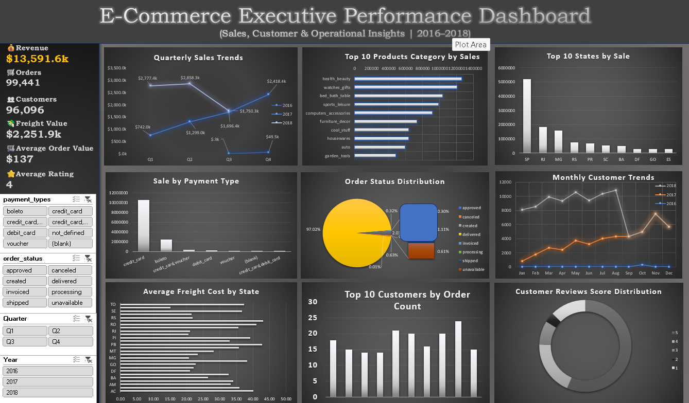

# Olist E-Commerce Sales & Customer Analytics


## 📌 Project Overview

This project is an end-to-end **E-Commerce Data Analytics project** based on the **Olist Brazilian E-Commerce dataset**.

The objective was to analyze multiple relational datasets, answer real-world business questions using SQL, transform and model the data using Excel Power Query and Power Pivot, and finally develop an interactive e-commerce dashboard.

The project demonstrates the complete analytics workflow:

**Raw Data → PostgreSQL → SQL Business Analysis → Power Query → Power Pivot Data Model → Pivot Tables → Dashboard & Business Insights**

---

## 🎯 Business Objective

The primary objective of this project was to analyze the Olist e-commerce business from different perspectives and identify insights related to:

* Sales performance
* Customer behavior
* Product performance
* Seller performance
* Payment methods
* Delivery performance
* Freight costs
* Customer reviews
* Monthly and yearly trends

The analysis was designed around **25 business questions** that simulate real-world requirements from an e-commerce business.

---

# 📊 Dataset

The Olist Brazilian E-Commerce dataset contains multiple relational datasets representing different entities of an e-commerce platform.

The project used **8 CSV files**, including data related to:

| Dataset                      | Description                                   |
| ---------------------------- | --------------------------------------------- |
| Customers                    | Customer and location information             |
| Orders                       | Order dates, status, and delivery information |
| Order Items                  | Products purchased, prices, and freight       |
| Order Payments               | Payment methods and payment values            |
| Order Reviews                | Customer review scores and comments           |
| Products                     | Product information and categories            |
| Sellers                      | Seller information and location               |
| Product Category Translation | Portuguese-to-English category mapping        |

The datasets were connected through common keys such as:

* `order_id`
* `customer_id`
* `customer_unique_id`
* `product_id`
* `seller_id`

---

# 🛠️ Tools & Technologies

### Database & SQL

* PostgreSQL
* pgAdmin 4
* SQL

### SQL Concepts Used

* SELECT
* DISTINCT
* JOIN
* GROUP BY
* HAVING
* ORDER BY
* LIMIT
* Aggregate Functions
* CTEs
* CASE
* COALESCE
* FILTER
* Subqueries
* Date & Timestamp Functions
* LAG()
* DENSE_RANK()
* Window Functions

### Excel

* Microsoft Excel
* Power Query
* Power Pivot
* Data Modeling
* Relationships
* Pivot Tables
* Pivot Charts
* Interactive Filters/Slicers
* Dashboard Development

---

# 🔄 Project Workflow

## Step 1 — Data Collection

The Olist dataset was provided as multiple CSV files representing different business entities.

The datasets were first imported into a PostgreSQL database for structured analysis.

---

## Step 2 — SQL Data Analysis

After importing the datasets into PostgreSQL, I developed SQL queries to answer 25 business questions.

The analysis covered sales, customers, products, sellers, payments, delivery performance, and customer reviews.

Examples include:

* Total number of orders
* Total sales value
* Total freight value
* Average Order Value
* Highest-selling product category
* State with the highest number of customers
* Most commonly used payment method
* Month-over-month sales growth
* Top 10 products by sales
* Highest-selling seller
* Percentage of delivered orders
* Average delivery time
* Highest-rated product category
* State with the highest sales
* Customers with multiple orders
* Average freight cost by category
* Seller ranking based on sales
* Monthly sales trends
* Top 3 product categories by year
* Highest-spending customer
* Category contribution to total sales
* Late-delivered orders
* Delivery time vs. review score
* New customers by first-purchase month
* Customer revenue using window functions

---

# 🧠 SQL Analysis Highlights

### Month-over-Month Sales Growth

Used:

* CTEs
* `LAG()`
* `COALESCE()`
* Date formatting

This was used to compare monthly sales performance and calculate sales growth between consecutive months.

---

### Seller Ranking

Used:

```sql
DENSE_RANK() OVER(
    ORDER BY SUM(price) DESC
)
```

This ranked sellers based on their total sales.

---

### Top Categories by Year

Used:

* CTE
* `DENSE_RANK()`
* `PARTITION BY`
* Aggregate functions

This identified the top 3 product categories for each year.

---

### Customer Revenue

Used window functions to calculate cumulative/customer-level revenue based on order values.

---

### Delivery Performance

Analyzed:

* Average delivery time
* Estimated vs. actual delivery date
* Late deliveries
* Delivery time and review score relationship

---

# 🔄 Step 3 — Power Query

After completing the SQL analysis, I connected the Olist CSV files to Excel using **Power Query**.

Power Query was used to:

* Import the datasets
* Prepare the data
* Transform required columns
* Maintain a structured data preparation workflow
* Load the processed data into Power Pivot

This provided a repeatable ETL-style workflow inside Excel.

---

# 🔗 Step 4 — Power Pivot Data Modeling

The datasets were loaded into **Power Pivot** and connected through relationships.

The relational model allowed multiple tables to work together for analysis and dashboard development.

Key relationships were established using fields such as:

```text
Customers
    ↓
Orders
    ↓
Order Items
    ↓
Products
```

Additional relationships were established with:

```text
Orders → Order Payments
Orders → Order Reviews
Order Items → Sellers
Products → Product Category Translation
```

This structure enabled cross-table analysis using Pivot Tables.

---

# 📊 Step 5 — Dashboard Development

After creating the data model, Pivot Tables and Pivot Charts were created to develop an interactive **Olist E-Commerce Performance Dashboard**.

## Dashboard KPIs

The dashboard focuses on key business performance indicators such as:

* Total Sales
* Total Orders
* Average Order Value
* Freight Value
* Customer Metrics
* Review Performance

## Dashboard Analysis

The dashboard provides analysis across areas including:

### Sales Performance

* Monthly sales trends
* Quarterly sales performance
* Sales by product category
* Sales by state

### Product Performance

* Top product categories
* Top-performing products

### Customer Analysis

* Customer trends
* Customer order behavior
* Top customers

### Payment Analysis

* Payment type distribution

### Order Analysis

* Order status distribution

### Logistics

* Freight cost analysis
* Delivery performance

### Customer Experience

* Review score distribution
* Average review performance

---

# 📷 Dashboard Preview



---

# 🎥 Dashboard Demo

A short dashboard demonstration is available in:

`Dashboard_Demo/Olist_Dashboard_Demo.mp4`

The demo shows the interactive dashboard, filters, charts, and key business metrics.

---

## 📥 Download the Excel Dashboard

The complete Excel workbook contains the Power Query transformations, Power Pivot data model, table relationships, Pivot Tables, Pivot Charts, and interactive dashboard.

👉 **[Download the Olist E-Commerce Dashboard](https://drive.google.com/file/d/1v7HY9B_YjtZ7bIFzH0Er2pE9FzSu5t_I/view?usp=sharing)**

> Note: The Excel workbook is hosted on Google Drive because its file size exceeds GitHub's web upload limit.

---

# 📈 Key Business Areas Analyzed

| Area      | Analysis                                           |
| --------- | -------------------------------------------------- |
| Sales     | Total sales, monthly trends, category contribution |
| Orders    | Total orders, order status, delivery status        |
| Customers | Customer count, repeat customers, customer revenue |
| Products  | Top products and categories                        |
| Sellers   | Seller sales and ranking                           |
| Payments  | Payment method usage                               |
| Logistics | Freight and delivery performance                   |
| Reviews   | Review scores and category ratings                 |
| Geography | Sales and customers by state                       |
| Time      | Monthly, quarterly, and yearly trends              |

---

# 💡 Key Learnings

This project helped strengthen my practical understanding of:

* Working with relational datasets
* Writing SQL for business problems
* Using JOINs across multiple tables
* Building reusable SQL analysis using CTEs
* Applying window functions
* Using `LAG()` for time-series analysis
* Using `DENSE_RANK()` for ranking
* Handling missing values with `COALESCE()`
* Performing data transformation with Power Query
* Building relationships using Power Pivot
* Creating Pivot Table-based dashboards
* Converting raw data into business insights
* Designing dashboards around business KPIs

---

# 📁 Repository Structure

```text
olist-ecommerce-sales-analytics/
│
├── README.md
│
├── SQL/
│   └── Olist_Business_Queries.sql
│
├── Dashboard_Screenshot/
│   └── Olist_Dashboard.png
│
├── Dashboard_Demo/
│   └── Olist_Dashboard_Demo.mp4
│
├── Dataset/
│   └── README.md
│
└── Documentation/
    └── Business_Questions.md
```

---

# 🚀 Project Highlights

**8 CSV datasets | 25 business questions | PostgreSQL | SQL | Power Query | Power Pivot | Excel Dashboard**

This project demonstrates an end-to-end data analytics workflow, starting from raw relational datasets and SQL-based business analysis and progressing to data transformation, data modeling, and interactive business intelligence reporting.

---

# 👨‍💻 Skills Demonstrated

**Technical Skills**

`SQL` `PostgreSQL` `Excel` `Power Query` `Power Pivot` `Data Modeling` `Pivot Tables` `Data Visualization`

**Analytical Skills**

`Business Analysis` `Data Cleaning` `Data Transformation` `KPI Analysis` `Sales Analysis` `Customer Analysis` `E-Commerce Analytics`

---

# 📌 Future Improvements

Potential future enhancements include:

* Rebuilding the dashboard in Power BI
* Adding DAX measures
* Creating a dedicated date/calendar table
* Adding more advanced customer segmentation
* Developing RFM customer analysis
* Adding automated refresh workflows
* Creating additional logistics KPIs

---

## ⭐ If you found this project useful

Feel free to explore the SQL queries, dashboard, and data-modeling workflow.

If you have feedback or suggestions, I would be happy to learn from them.
